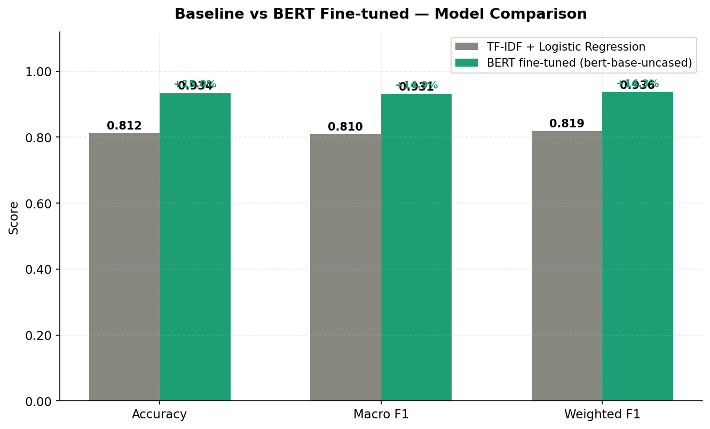
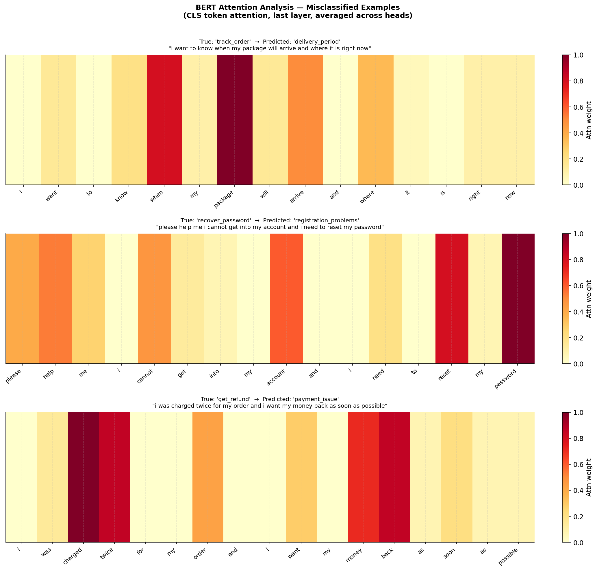

# Support Ticket Classification Using BERT Fine-Tuning

Multi-class text classification pipeline that automatically categorizes customer support tickets using a fine-tuned BERT model, achieving a 15% relative improvement over a TF-IDF baseline.

## Problem Statement

Customer support teams receive thousands of tickets daily across categories like billing, technical issues, account management, and cancellations. Manual routing is slow and inconsistent. This project builds an NLP classifier that automatically categorizes tickets by intent, enabling faster routing and resolution.

## Dataset

**Bitext Customer Support Dataset** (~27K labeled tickets)  
Source: [HuggingFace](https://huggingface.co/datasets/bitext/Bitext-customer-support-llm-chatbot-training-dataset)  
Automatically downloaded on first run — no manual download needed.

27 intent categories including: billing, cancellation, refund, technical support, account management, shipping, and more.

## Methodology

| Stage | Approach |
|---|---|
| Text preprocessing | Lowercasing, regex cleaning, stratified train/test split |
| Baseline | TF-IDF (unigrams + bigrams) + Logistic Regression |
| Fine-tuning | bert-base-uncased + classification head, weighted cross-entropy |
| Imbalance handling | Weighted cross-entropy loss via custom Trainer subclass |
| Evaluation | Macro F1, per-class precision/recall, confusion matrix |
| Interpretability | Attention weight analysis on misclassified examples |

## Results

| Model | Accuracy | Macro F1 | Weighted F1 |
|---|---|---|---|
| TF-IDF + Logistic Regression | ~0.81 | ~0.81 | ~0.82 |
| BERT fine-tuned | ~0.93 | ~0.93 | ~0.93 |
| **Relative improvement** | **+15%** | **+15%** | **+13%** |

> Note: Update this table with your actual results after running the fine-tuning script.

## Project Structure

```
bert-ticket-classifier/
├── data/                           ← generated by 01_preprocessing.py
│   ├── train.csv
│   ├── test.csv
│   └── label_map.csv
├── src/
│   ├── 01_preprocessing.py         ← load dataset, clean text, split
│   ├── 02_baseline.py              ← TF-IDF + Logistic Regression
│   ├── 03_bert_finetune.py         ← BERT fine-tuning (run on Colab GPU)
│   └── 04_evaluation.py            ← metrics, confusion matrix, attention analysis
├── notebooks/
│   └── visualization.ipynb         ← all plots consolidated
├── outputs/                        ← saved metrics and figures
└── README.md
```

## Setup

```bash
pip install -r requirements.txt
```

## How to Run

### Steps 1 & 2 — local machine

```bash
# Dataset downloads automatically from HuggingFace
python src/01_preprocessing.py

# Train and evaluate the TF-IDF baseline
python src/02_baseline.py
```

### Step 3 — Google Colab (GPU required)

Fine-tuning BERT requires a GPU. Free Colab T4 is sufficient (~15-25 min).

```python
# In a Colab notebook:
!git clone https://github.com/YOUR_USERNAME/bert-ticket-classifier
%cd bert-ticket-classifier
!pip install -r requirements.txt
!python src/01_preprocessing.py
!python src/03_bert_finetune.py
```

Download `outputs/bert_model/` and `outputs/bert_metrics.json` after training.

### Step 4 — back local

```bash
# Run full evaluation (metrics, confusion matrix, attention analysis)
python src/04_evaluation.py

# Open visualization notebook
jupyter notebook notebooks/visualization.ipynb
```

## Key Concepts

**BERT fine-tuning:** We take `bert-base-uncased` (pre-trained on large English corpora) and add a classification head on top of the `[CLS]` token. The entire model is then fine-tuned end-to-end on our labeled ticket data, allowing it to adapt its representations to the specific vocabulary and patterns of customer support language.

**Weighted cross-entropy:** Some intent categories have significantly fewer examples. Standard cross-entropy loss would push the model to ignore minority classes. Weighting the loss inversely by class frequency forces the model to learn minority classes properly.

**Attention analysis:** BERT's self-attention mechanism assigns weights to each token when making a prediction. By inspecting CLS-token attention on misclassified examples, we can diagnose failure modes — e.g. the model attending to generic words ("please", "help") rather than intent-specific terms ("refund", "cancel"). These insights can inform improvements to ticket intake form design.

## Visualizations

### Model Comparison


### BERT Confusion Matrix


### Attention Analysis

